# Take Me Pic — Database Schema

Backend: **Supabase** (Postgres 15 + PostGIS + Auth + Storage + Realtime + RLS).
Designed from the PRD's 12 modules and the mobile mock layer (`data/mock.ts`),
following the `supabase-postgres-best-practices` skill.

Project: `https://oxexcljzzemfenzogcnz.supabase.co` · migration: `supabase/migrations/0001_initial_schema.sql`

## Design decisions (and the rule each follows)

| Decision | Best-practice rule |
|---|---|
| `profiles.id` is `uuid` referencing `auth.users(id)`; all other PKs are `bigint generated always as identity` | `schema-primary-keys` (sequential bigint for single-DB; uuid only where Auth requires) |
| `geography(point,4326)` + **GiST** indexes on `presence`, `help_requests`, `spots`, `sponsored_campaigns`; nearby search via `ST_DWithin` + KNN `<->` order | `query-index-types` (GiST for geo/KNN) — the latency-critical "30s" path |
| **RLS enabled + forced** on all 34 tables; every policy wraps `auth.uid()` in `(select auth.uid())` | `security-rls-basics`, `security-rls-performance` |
| Authenticated Data API grants are included after the RLS policies | Supabase's 2026 table-exposure change: grants expose objects; RLS still controls rows |
| Index on every FK and every RLS-predicate column | `schema-foreign-key-indexes`, `security-rls-performance` |
| Request lifecycle is a DB-enforced state machine (trigger rejects illegal transitions) | `schema-constraints` |
| `SECURITY DEFINER` helpers (`has_role`, `is_staff`, `in_conversation`) in a private, non-exposed schema with identity checks | `security-rls-performance`, `security-privileges` |
| `leaderboard` is a `security_invoker` view | Supabase view security: views should not bypass table RLS |
| GIN indexes on `profiles.languages` (array), `subscriptions.entitlements` (jsonb), `profiles.username` (trgm) | `query-index-types`, `advanced-jsonb-indexing` |
| Denormalized counters (`karma`, `hearts_count`, `followers`…) cached on rows, ledger/junction tables as source of truth | `data-n-plus-one` |

## Entity-relationship diagram

```mermaid
erDiagram
  auth_users ||--|| profiles : "is"
  profiles ||--o{ user_roles : has
  profiles ||--|| presence : "broadcasts (session-only GPS)"

  profiles ||--o{ help_requests : requests
  profiles ||--o{ help_requests : helps
  help_requests ||--o| conversations : coordinates
  conversations ||--o{ conversation_participants : has
  profiles ||--o{ conversation_participants : joins
  conversations ||--o{ messages : contains
  profiles ||--o{ messages : sends
  help_requests ||--o{ session_photos : produces

  help_requests ||--o{ ratings : "rated after"
  profiles ||--o{ ratings : rates
  profiles ||--o{ karma_ledger : earns

  profiles ||--o{ posts : authors
  posts ||--o{ post_likes : gets
  posts ||--o{ comments : has
  profiles ||--o{ comments : writes
  profiles ||--o{ follows : follows
  spots ||--o{ posts : tagged_in
  spots ||--o{ spot_photos : has
  spots ||--o{ spot_tips : has
  profiles ||--o{ spots : creates

  profiles ||--o{ subscriptions : owns
  profiles ||--o{ bookings : books
  businesses ||--o{ sponsored_campaigns : funds
  spots ||--o{ sponsored_campaigns : sponsors

  profiles ||--o{ itineraries : plans
  itineraries ||--o{ itinerary_steps : contains
  profiles ||--o{ ai_suggestions : requests

  profiles ||--o{ families : owns
  families ||--o{ family_members : includes
  profiles ||--o{ family_members : "is"

  profiles ||--o{ notifications : receives
  profiles ||--o{ push_tokens : registers

  profiles ||--o{ reports : files
  profiles ||--o{ blocks : blocks
  profiles ||--o{ bans : "subject of"
  profiles ||--o{ admin_audit_log : "acts in"
```



## Tables by PRD module

| PRD module | Tables / objects |
|---|---|
| 1 · Proximity & Presence | `presence`, fn `find_available_helpers(lng,lat,radius)` |
| 2 · Help Request & Matching | `help_requests` (+ transition trigger) |
| 3 · Realtime Session & Chat | `conversations`, `conversation_participants`, `messages`, `session_photos` |
| 4 · Karma & Reputation | `ratings`, `karma_ledger`, view `leaderboard` (TMP Stars) |
| 5 · Identity & Trust/Safety | `profiles`, `reports`, `blocks`, `bans`, `admin_audit_log` |
| 6 · Subscriptions (Premium) | `subscriptions` (RevenueCat / Apple IAP entitlements jsonb) |
| 7 · Payments & Bookings | `bookings`, `businesses`, `sponsored_campaigns` (Stripe) |
| 8 · Community Feed & Spots | `posts`, `post_likes`, `comments`, `follows`, `spots`, `spot_photos`, `spot_tips` |
| 9 · Notifications | `notifications`, `push_tokens` (APNs/FCM) |
| 10 · Admin auth & ops | `user_roles` + `private.has_role/is_staff` (RBAC) |
| 11 · AI PhotoHelper | `ai_suggestions`, `framing_tips` |
| 12 · i18n/RTL | client-side only (no schema) |
| Ecosystem · Itineraries | `itineraries`, `itinerary_steps` |
| Ecosystem · Family mode | `families`, `family_members` |

## The killer query (PostGIS)

```sql
-- "available helpers within 1.5 km of me, nearest first"
select * from find_available_helpers(2.3364, 48.8606, 1500);
```
Backed by `presence_location_gix` (GiST). `ST_DWithin` does the radius filter on
the index; `<->` orders by true distance (KNN). This is the "nearby in 30s"
promise the PRD calls the single most important query in the product.

## How to apply

The provided key is the **publishable** client key — it cannot run DDL. Apply the
migration with either:

```bash
# A) Supabase CLI (needs project ref + db password or access token)
supabase link --project-ref oxexcljzzemfenzogcnz
supabase db push

# B) Paste supabase/migrations/0001_initial_schema.sql into the SQL Editor
#    (Dashboard → SQL Editor → New query → Run)
```

A Storage bucket `session-photos` (private) and `avatars`/`posts` (public) should
be created for the `*_url` / `storage_path` columns.

After applying, verify that the Data API exposes the public schema objects for the
`authenticated` role. The migration grants table/view/function privileges, but the
Supabase Dashboard's Data API exposure settings can still determine which schemas
and objects are served.
